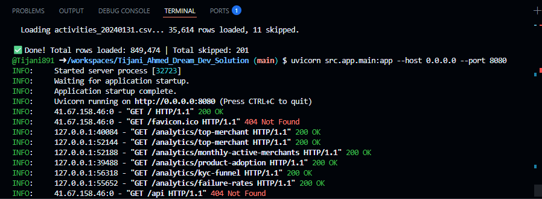

# Moniepoint Analytics API

**Author:** Tijani Ahmed

A REST API that processes merchant activity logs and exposes business insights for Moniepoint's Growth & Intelligence team.

---

## Assumptions

- CSV files are in the `data/` directory at the project root.
- Malformed or unparseable rows are skipped gracefully without aborting the import.
- "Product adoption" counts any merchant with at least one event per product (any status).
- Failure rate excludes PENDING: `FAILED / (SUCCESS + FAILED) * 100`.
- All 5 endpoint responses are cached in memory after first request (dataset is static).
- Amount fields with non-numeric values (e.g. `INVALID`) are replaced with `0`.

---

## Prerequisites

- Python 3.11+
- PostgreSQL

---

## Setup & Run

### Option A — Running Locally

#### 1. Clone the repo
```bash
git clone https://github.com/Tijani891/Moniepoint_Analytics_API
cd moniepoint-analytics
```

#### 2. Create and activate virtual environment
```bash
python -m venv venv
source venv/bin/activate        # Mac/Linux
venv\Scripts\activate           # Windows
```

#### 3. Install dependencies
```bash
pip install -r requirements.txt
```

#### 4. Create PostgreSQL database
Open your PostgreSQL shell and run:
```sql
CREATE DATABASE moniepoint;
```

#### 5. Configure environment
Edit `.env` with your database credentials:
```
DB_HOST=localhost
DB_PORT=5432
DB_NAME=moniepoint
DB_USER=postgres
DB_PASSWORD=your_password
```

#### 6. Add CSV files
Place all `activities_YYYYMMDD.csv` files into the `data/` folder:
```
moniepoint-analytics/
└── data/
    ├── activities_20240101.csv
    ├── activities_20240102.csv
    └── ...
```

#### 7. Import data (run once)
```bash
python scripts/ingest.py
```

Expected output:
```
Creating table...
Creating indexes...
Table and indexes ready.
Found 31 CSV file(s). Starting import...
  Loading activities_20240101.csv... 27,328 rows loaded, 6 skipped.
  ...
✅ Done! Total rows loaded: 849,474 | Total skipped: 201
```

#### 8. Start the API
```bash
uvicorn src.app.main:app --host 0.0.0.0 --port 8080
```

---

### Option B — Running on GitHub Codespaces

#### 1. Open the repo in Codespaces
Click **Code → Codespaces → Create codespace on main** on the GitHub repo page.

#### 2. Install and start PostgreSQL
```bash
sudo apt-get update
sudo apt-get install -y postgresql
sudo service postgresql start
```

#### 3. Set PostgreSQL password and create database
```bash
sudo su - postgres -c "psql -c \"ALTER USER postgres PASSWORD 'postgres';\""
sudo su - postgres -c "psql -c \"CREATE DATABASE moniepoint;\""
```

#### 4. Configure environment
Edit `.env`:
```
DB_HOST=localhost
DB_PORT=5432
DB_NAME=moniepoint
DB_USER=postgres
DB_PASSWORD=postgres
```

#### 5. Install dependencies
```bash
pip install -r requirements.txt
```

#### 6. Add CSV files
Place all `activities_YYYYMMDD.csv` files into the `data/` folder.

#### 7. Import data (run once)
```bash
python scripts/ingest.py
```

#### 8. Start the API
```bash
uvicorn src.app.main:app --host 0.0.0.0 --port 8080
```

---

## API Endpoints & Sample Responses

### GET /analytics/top-merchant
Returns the merchant with the highest total successful transaction amount across all products.
```bash
curl http://localhost:8080/analytics/top-merchant
```
```json
{"merchant_id": "MRC-009405", "total_volume": 181479333.57}
```

---

### GET /analytics/monthly-active-merchants
Returns the count of unique merchants with at least one successful event per month.
```bash
curl http://localhost:8080/analytics/monthly-active-merchants
```
```json
{"2024-01": 9848}
```

---

### GET /analytics/product-adoption
Returns unique merchant count per product, sorted highest first.
```bash
curl http://localhost:8080/analytics/product-adoption
```
```json
{
  "BILLS": 4379,
  "SAVINGS": 4368,
  "POS": 4349,
  "AIRTIME": 4277,
  "MONIEBOOK": 4267,
  "CARD_PAYMENT": 4233,
  "KYC": 4167
}
```

---

### GET /analytics/kyc-funnel
Returns the KYC conversion funnel (successful events only).
```bash
curl http://localhost:8080/analytics/kyc-funnel
```
```json
{
  "documents_submitted": 3760,
  "verifications_completed": 3389,
  "tier_upgrades": 2496
}
```

---

### GET /analytics/failure-rates
Returns failure rate per product, sorted descending. PENDING excluded.
```bash
curl http://localhost:8080/analytics/failure-rates
```
```json
[
  {"product": "BILLS", "failure_rate": 5.3},
  {"product": "CARD_PAYMENT", "failure_rate": 5.2},
  {"product": "AIRTIME", "failure_rate": 5.2},
  {"product": "MONIEBOOK", "failure_rate": 5.2},
  {"product": "POS", "failure_rate": 5.2},
  {"product": "SAVINGS", "failure_rate": 5.2},
  {"product": "KYC", "failure_rate": 5.2}
]
```

---

## Screenshots

### API Running in Terminal


### API Response in Browser


---

## Interactive Docs

Visit **http://localhost:8080/docs** for the full interactive API documentation powered by Swagger UI.

---

## Project Structure
```
moniepoint-analytics/
├── src/
│   └── app/
│       ├── __init__.py
│       ├── database.py        # PostgreSQL connection pool
│       ├── main.py            # FastAPI app entry point
│       ├── routers/
│       │   ├── __init__.py
│       │   └── analytics.py   # 5 API endpoints
│       └── services/
│           ├── __init__.py
│           └── analytics.py   # SQL queries + in-memory cache
├── scripts/
│   └── ingest.py              # CSV → PostgreSQL bulk loader
├── data/                      # Place CSV files here
├── pictures/                  # Screenshots
├── requirements.txt
├── .env                       # DB credentials (not committed)
└── README.md
```
